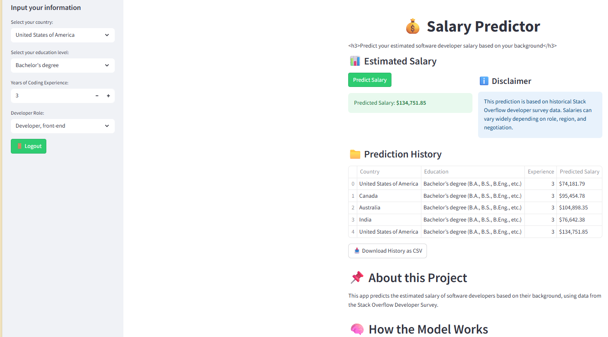

# Salary-Predictor

This project provides an intelligent web-based application that predicts annual salaries based on real-world survey data. By inputting key variables such as your country, education level, job role, and years of experience, the model generates a reliable salary estimate using machine learning techniques. The goal is to help professionals and job seekers make informed, data-driven career decisions.

---

## Demo




---

## Features

- Predicts salary based on:
  - Country
  - Education level
  - Years of experience
  - Job role
- Interactive visualizations using Plotly
- Powered by trained machine learning models
- Clean UI built with Streamlit
- Handles large model/data files via Git LFS

---

## Requirements

Make sure you have the following installed:

- Python 3.9 or later
- pip
- Git LFS (for handling large model/data files)

---

## Installation

```bash
git clone https://github.com/Aariz1706/Salary-Predictor.git
cd Salary-Predictor

To start the app locally, run:
```bash
streamlit run app/app.py
